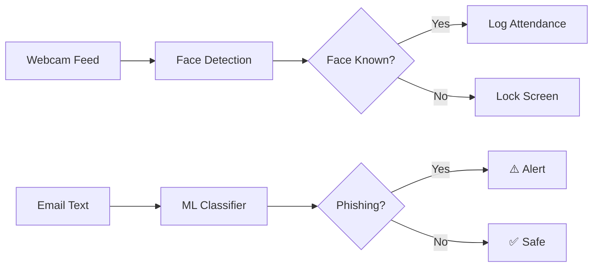

<div align="center">

# 🛡️ ScamAI

**AI-Powered Screen Security & Phishing Detection System**

[](https://python.org)
[](https://flask.palletsprojects.com)
[](https://opencv.org)
[](LICENSE)

ScamAI is a real-time face recognition-based screen security system with integrated phishing email detection. It uses webcam-based facial recognition to verify authorized users and can lock the screen when an unauthorized face is detected.

</div>

---

## ✨ Features

### 🔐 Face Recognition Guard
- **Real-time face detection** via webcam using dlib's ResNet-34 deep CNN
- **Automatic screen lock** when an unauthorized face is detected
- **Confidence scoring** for each recognized face
- **HOG-based** face location detection for fast performance

### 👤 Face Registration
- **Browser-based capture** — register faces directly from the web UI
- **Automatic data augmentation** — each capture generates 4 variations (original, flipped, bright, dark)
- **Auto-retrain** — model re-encodes all faces immediately after registration

### 📋 Attendance Logging
- **Automatic attendance** — recognized users are logged with date & time
- **De-duplication** — each person is only logged once per day
- **CSV-based storage** — simple, portable attendance records
- **Date-filtered queries** via the REST API

### 🎣 Phishing Email Detection
- **ML-powered classifier** to detect phishing emails
- **Confidence scoring** for predictions
- **Pre-trained model** included and ready to use

---

## 📁 Project Structure

```
ScamAI/
├── app.py                  # Flask API server (main entry point)
├── recognize.py            # Face recognition engine (encode, compare, train)
├── register.py             # CLI-based face registration (standalone)
├── phishing.py             # Phishing email detection module
├── requirements.txt        # Python dependencies
├── attendance.csv          # Auto-generated attendance log
├── encodings.pkl           # Trained face encodings (auto-generated)
│
├── dataset/                # Face image dataset (organized by person)
│   ├── Person_Name/
│   │   ├── 1.jpg
│   │   ├── 2.jpg
│   │   └── ...
│   └── ...
│
├── models/
│   └── phishing_detector.pkl   # Pre-trained phishing detection model
│
├── data/
│   └── preprocessed_data.pkl   # Vectorizer for phishing detection
│
└── frontend/               # Single Page Application (SPA)
    ├── index.html           # Main HTML shell
    ├── css/
    │   └── styles.css       # UI styles
    └── js/
        ├── api.js           # API client functions
        ├── app.js           # App initialization & bootstrapping
        ├── router.js        # Hash-based SPA router
        └── pages.js         # Page components & UI logic
```

---

## 🚀 Getting Started

### Prerequisites

- **Python 3.10+**
- **CMake** (required to build dlib)
- **Webcam** (for face registration and recognition)

> [!NOTE]
> On Ubuntu/Debian, install system dependencies first:
> ```bash
> sudo apt-get update
> sudo apt-get install cmake build-essential libopenblas-dev liblapack-dev
> ```

### Installation

1. **Clone the repository**
   ```bash
   git clone https://github.com/meAnkit18/AI-attencence.git
   cd AI-attencence
   ```

2. **Create a virtual environment**
   ```bash
   python -m venv venv
   source venv/bin/activate    # Linux/macOS
   # venv\Scripts\activate     # Windows
   ```

3. **Install dependencies**
   ```bash
   pip install -r requirements.txt
   ```

4. **Run the application**
   ```bash
   python app.py
   ```

5. **Open in your browser**
   ```
   http://localhost:5000
   ```

---

## 🔌 API Reference

| Method | Endpoint | Description |
|--------|----------|-------------|
| `GET` | `/api/people` | List all registered people |
| `POST` | `/api/register` | Register a new face (base64 images) |
| `POST` | `/api/recognize` | Recognize faces in a frame |
| `GET` | `/api/attendance` | Get attendance (query: `?date=YYYY-MM-DD`) |
| `GET` | `/api/attendance/all` | Get all attendance records |
| `POST` | `/api/train` | Re-train face encodings |
| `GET` | `/api/stats` | Get dashboard statistics |
| `POST` | `/api/phishing/detect` | Detect phishing email |

### Example: Register a Face

```bash
curl -X POST http://localhost:5000/api/register \
  -H "Content-Type: application/json" \
  -d '{"name": "John Doe", "images": ["data:image/jpeg;base64,..."]}'
```

### Example: Detect Phishing Email

```bash
curl -X POST http://localhost:5000/api/phishing/detect \
  -H "Content-Type: application/json" \
  -d '{"text": "Congratulations! You have won a $1000 gift card. Click here to claim."}'
```

---

## 🛠️ Tech Stack

| Layer | Technology |
|-------|-----------|
| **Backend** | Python, Flask, Flask-CORS |
| **Face Recognition** | `face_recognition` (dlib ResNet-34), OpenCV |
| **ML Model** | scikit-learn (phishing classifier) |
| **Frontend** | Vanilla HTML/CSS/JS (SPA architecture) |
| **Storage** | CSV (attendance), Pickle (encodings & models) |

---

## 📖 How It Works



1. **Registration** — The user captures face images via the web UI. Images are augmented (flipped, brightness adjusted) and stored in the `dataset/` directory. The system then encodes all faces into 128-dimensional embeddings using dlib's ResNet-34 model.

2. **Recognition** — Each webcam frame is processed to detect faces (HOG model), encode them, and compare against stored encodings using Euclidean distance. Matches below the tolerance threshold (0.5) are identified.

3. **Guard Mode** — Continuously monitors the webcam. Recognized users are auto-logged for attendance. Unrecognized faces trigger a screen blackout alert.

4. **Phishing Detection** — Email text is vectorized and run through a pre-trained classifier that returns a label (`Phishing` / `Not Phishing`) with a confidence score.

---

## 🤝 Contributing

Contributions are welcome! Feel free to open issues or submit pull requests.

1. Fork the repository
2. Create your feature branch (`git checkout -b feature/amazing-feature`)
3. Commit your changes (`git commit -m 'Add amazing feature'`)
4. Push to the branch (`git push origin feature/amazing-feature`)
5. Open a Pull Request

---

## 📄 License

This project is open source and available under the [MIT License](LICENSE).

---

<div align="center">

**Built with ❤️ using Python & AI**

</div>
